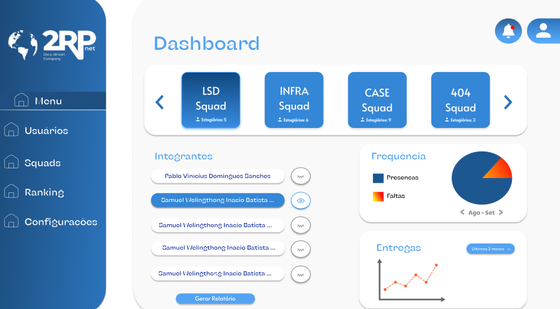
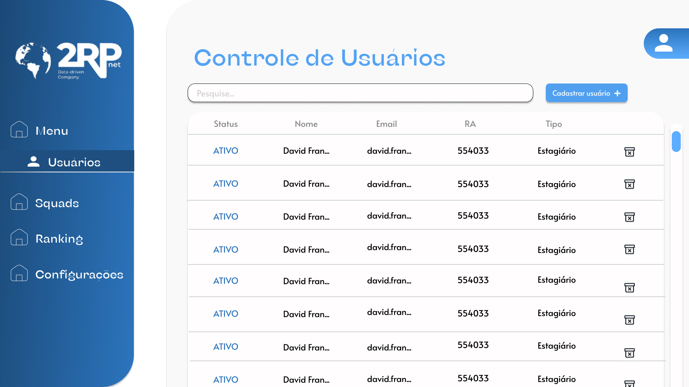
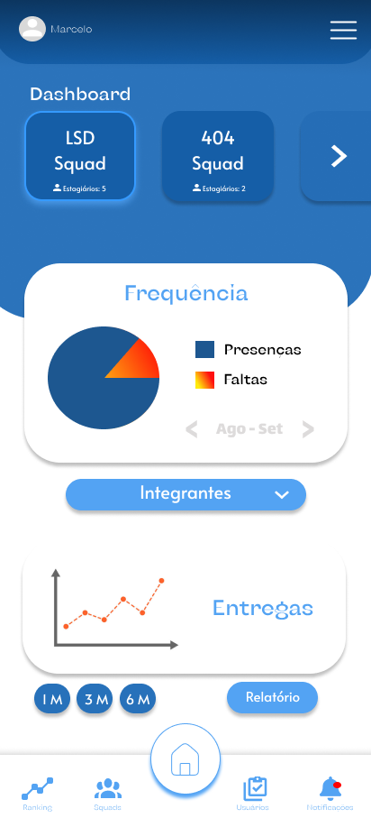
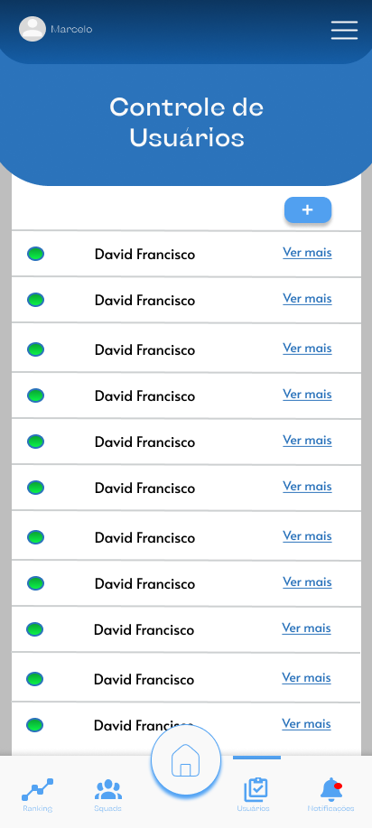

# Sistema de Gestão de Estagiários

## 🎯 Objetivo
- Substituir o uso de planilhas manuais no Excel por um sistema automatizado.  
- Garantir maior eficiência no controle de frequência, registro de avaliações e geração de relatórios.  
- Apoiar gestores na análise de desempenho e na tomada de decisões estratégicas sobre os estagiários.  
- Reduzir erros, retrabalho e tempo gasto em processos manuais.  

## 👥 Público-Alvo
- Empresas que possuem programas de estágio.  
- Coordenadores e gestores responsáveis pelo acompanhamento dos estagiários.  
- Departamentos de Recursos Humanos que necessitam centralizar e analisar informações de desempenho.  
- Estagiários, como usuários indiretos, que terão avaliações mais claras e objetivas.  

## 💼 Modelo de Negócio
- **Software como Serviço (SaaS):** sistema baseado em nuvem, com assinatura mensal ou anual.  
- **Planos escalonados:** cobrança conforme o número de estagiários ou funcionalidades utilizadas.  
- **Relatórios Premium:** disponibilização de relatórios avançados de desempenho mediante planos superiores.  
- **Consultoria e Treinamento:** oferta de suporte para implantação e capacitação de gestores.  
- **Integrações:** possibilidade de integração com sistemas de RH já existentes na empresa, agregando valor ao serviço.  

## Protótipo figma
[Figma](https://www.figma.com/design/D6GEmmBtiQgZz95ZBHu6e3/Projeto-Integrador-Final?node-id=2171-437&t=PVDDFM91PEPljFeC-0)

## Versão Web

</img>

</img>

</img>

</img>

## Versão Mobile

</img>

</img>

</img>

</img>

